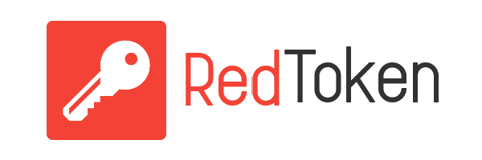

# :closed_lock_with_key: RedToken Project

> ### :warning: This repo is in development status yet. Be aware to use it.

**Secure Authorization Web Portal & Key-Value Storage Server** to link all of your own services.

## :bookmark_tabs Here is 2 submodules

- [RedToken Server](https://github.com/jkulvichs-sandbox/red-token-server)  
    
    
    
    
    
    
    
- RedToken Front (Coming Soon)    

This repo just is a submodules' container and contains overview documentation.
Also, here you can get [last release bundles](https://github.com/jkulvichs-sandbox/red-token/releases).

If something goes wrong, or you have an idea then make an issue in this repo instead of submodules issue, please.  

## :arrow_down: Cloning

The project contains submodules. If you would like to clone it all type this:
> `git clone --recurse-submodules https://github.com/jkulvichs-sandbox/red-token`

